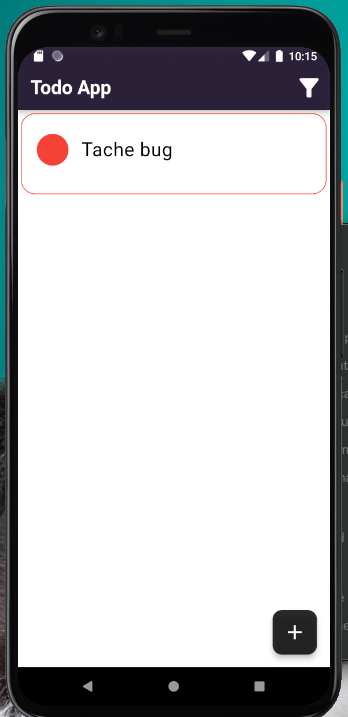

<h1 align="center">
  Todo - Simple & Beautiful
  <br>
</h1>


<p float="left">
  
   
  
  
  
  
  
  
  
  
</p>

## Réalisé par 
Aminata BA </br>
Aminata DIAGNE </br>
Mariama DIOUM </br>
Dié SYLLA </br>


## Utilisation

Pour cloner et utiliser cette application, vous aurez besoin de [Git](https://git-scm.com) et [Flutter](https://flutter.dev/docs/get-started/install) installé sur votre pc. Ensuite suivez ces commandes : 

```bash
# Clone this repository
$ git clone https://github.com/aminata054/flutter_todo.git

# Go into the repository
$ cd fluttery-todo

# Install dependencies
$ flutter packages get

# Run the app
$ flutter run
```
